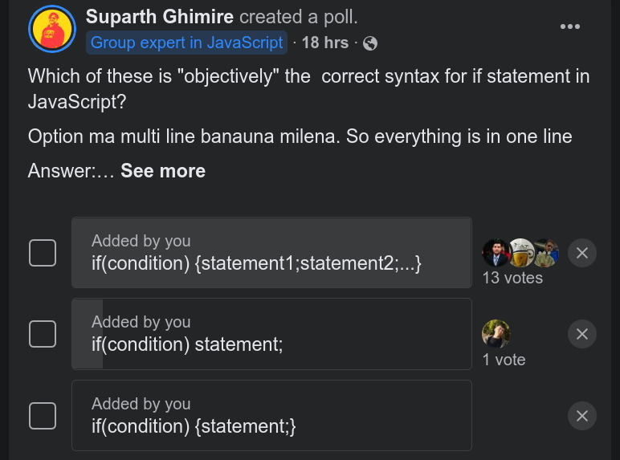

# You Don't Understand Statements (in JavaScript)

You think you do, but you dont.

# What?

From the day we started to learn programming, few words are fed to us. `Variables`, `constants`, `functions`, `classes`, `statements` etc. All of them are very easy to understand, but something about `statements` always seem confusing. It is not something that needs to be understood completely to be able to write a program though! I mean we can all write a simple program to add two numbers in programming language of choice right? Even further, we can create a calculator application using `if` and `switch` `statements` along with arithmetic operators. Then what is all the fuss about? Why am I writing this blog? It might feel redundant at first, but believe me when I say you don't fully understand the meaning behind `statements` in low level computing (what compiler understands).

# Why?

Why is this important? Why am I reading this blog? Why should I care about it when I can create a server to create REST APIs and an entire full stack application? I know how `control statements` work. What is your point?

`Statements` are fundamental building blocks that make or break a programming language. Knowing how something works does not mean you fully understand what it means. Many of us are not privy to the concept of how compilers work, and how the code we write gets compiled. The legend Linus Torvalds once said "`If you think like a computer, writing C makes sense`" and "`When I read C, I know what the assembly language will look like`"

[_Here is the video where he says this_](https://youtu.be/MShbP3OpASA?t=1293)

You can intrepret this in anyway you like, but what I understand is writing code in a language means you need to understand what it is going on underneath. Knowing how to do something to make it work isn't enough.

# Point?

Saying this, I know many of us already know the meaning of statements and how they work in respective programming language of choice. But I did a poll recently in an IT Community - `ITSNP` _(its a great community. [Join Here](https://www.facebook.com/groups/782203342561098) if you have not already)_

The question was

- **Which of these is "objectively" the correct syntax of if statement in JavaScript?**
  ```js
  if (condition) statement;
  ```
  ```js
  if (condition) {
    statement;
  }
  ```
  ```js
  if(condition) {
      statement 1;
      statement 2;
      ...
  }
  ```

_Answer it before moving further to see if you were correct._

# Poll Result

This was the result of the Poll.



Before providing the answer to the question of the poll lets understand what `statement` means and how do they work.

# Statements

We have all heard that variables/operators/functions make an expression and expressions make up statements.

Example:

```js
a + b;
```

is an expression and

```js
c = a + b;
```

is a statement

This shows that the common syntax for any sequence of characters to be a statement is

<a id="cfg_example"></a>

## Generalization

```js
variable = expression;
```

Okay. But we also have `if` statements, `for` statement, `while` statement? What are those? They don't follow this syntax. Are they not statements? They are. That is why this traditional definition of `statement` is not correct.

## Correction

The correct definition of statement would be:

**A command given to the computer to instruct it to perform some action.**

The thing to note here is the phrase `instruct it perform some action`.
Not `task`, but `action`. If you replace the word `action` by `task`
then the definition:

**A command given to the computer to instruct it to perform some task.**

would define a `program`.

# Action?

Action can be anything.

- Perform arithmetic operation
- Check for boolean logic
- Jump to some other part of program
  etc.

These actions all are classified into different types in different programming languages.

In JavaScript some of them are as follows:

- Expression Statement -> (all statements ending with semicolon ";")
- Jump Statement -> (Function Calls)
- Labeled Statement -> (Switch Case)
- Selection Statement -> (if else statements)

However, compiler understands statements by generalizing them in 2 different types.

- Simple Statement: Single Statement

Single Statements are usually written in a single line \
Example:

```js
let y = 3 + 10;
```

The next one is Compound Statement, which we will discuss after a while.

# Statements in the Madness of CFG - Compiler Design

_Note: to avoid confusion I am not writing the examples of CFG here in the preffered convention, but as simple single Uppercase characters_

A compiler reads statement as a syntax. The syntax of a compiler is understood as a grammer. The grammer is known as `Context Free Grammer` or `CFG`.

A `CFG` for representing syntax for simple arithmetic statement can be written in this way

```js
S -> id = E
E -> E + E | E - E | E * E | E / E | (E) | id
```

These are read as

- `S` produces `id = E`
- E produces `E + E` or `E - E` or `E * E` or `E / E` or `(E)` or `id`

_This only is a simple representation. This does not represent everything_

Here `id` is a `terminal symbol` (assume a variables for now)
`S` and `E` are `non terminal symbols`. `S` means Syntax and `E` means Expression who are recursive in nature.

# WTF?

I know this is confusing, but bear with me for a moment

Imagine this being a recursive function, where the production of terminal symbom (`id`) is the base case, and production of non terminal symbols (`S` and `E`) are recursive case.

Say a compiler has to parse this arithmetic statement

```js
x = a + b - a / b;
```

Then a syntax tree is formed this way

```
Breakdown                    | Reason
-----------------------------------------------------------------------
S  -> id = E                 | (Production of S)
rm -> id = E - E             | (E produces E - E -> recursive breaking)
rm -> id = E - (E)           | (E produces (E) -> recursive breaking)
rm -> id = E - (E / E)       | (E produces E / E -> recursive breaking)
rm -> id = E - (E/id)        | (E produces id -> recursive breaking)
rm -> id = E - (id/id)       | (E produces id -> recursive breaking)
rm -> id = E + E - (id/id)   | (E produces E + E -> recursive breaking)
rm -> id = E + id - (id/id)  | (E produces id -> recursive breaking)
rm -> id = id + id - (id/id) | (E produces id -> recursive breaking)
```

_rm means right most_

the end of this recursive definition resulted in all production reaching a terminal symbol. This means the statement

```js
x = a + b - a / b;
```

is correct.

This creates a syntax tree that looks like this


If you see closely, this approach is similar to solving a simplification problem using BODMAS rule. This is how compiler parses an arithmetic statement.

_If you want to learn more about Context Free Grammers, here is a link to series of videos along with written material by `Daniel Shiffman`. [Contect Free Grammer](https://shiffman.net/a2z/cfg/)_

I know this is confusing and it might seem like I am going off topic, but giving you context before jumping forwards was necessary.

# Compound Statements

We discussed the syntax of a simple statement above right. Then what would be the syntax for a compound one?

First we need to change the way we define a simple statement, not as simple expression but a sentence of logic such as

- It is raining
- It is cold \
  etc.

These are simple statements in logic, which are represented by

- p: It is raining
- q: It is cold

Compound statements then can be created by combining them using conjunctive words like and, or, if..then \
Example:

| Description | Symbolic | Statement                    |
| :---------- | :------- | :--------------------------- |
| p and q     | p V q    | It is raining and it is cold |
| p or q      | p ^ q    | It is raining or it is cold  |

This shows that compound statements dont need to be in multiple lines. Compound statements mean combination of simple statements. Simple statements in multiple lines are called Collection of multiple statements.
Collection of multiple simple statements are one of the production of compound statements.

Hence, `c = a || b`, `d = a && b`, etc. they all are compound statements as they combine two or more simple statements.

A question then, are a + b, a - b compound statements?

No. Why? These operators donot combine two statements, but they provide a single answer by doing an operation.

# Answering the Mystery

| Description | Symbolic | Statement                        |
| :---------- | :------- | :------------------------------- |
| p implies q | p => q   | If it is raining then it is cold |

We see that if statements ar a compound statements as they comprise of multiple simple statements.

Hence, in JavaScript, if we had to create a production for if statement syntax, we would create it this way

_Using proper naming convention for CFG here_

```js
<stmt> -> if(<expr>) <stmt>
<stmt> -> <compound_stmt>
<compound_stmt> -> { <stmt_list> }
<stmt_list> -> <stmt> <stmt_list> | epsilon
```

# The answer

Compilers read code from a `*.js` file. They all are bunch of characters written together. We programmers write code in a way that the compiler understands. There are certain predefined structure to write a syntax for alot of statements. `If` being one of them.

The syntax above is how `if` statement is defined in JavaScript. What does that mean?

It means that whenever it encounters the word if, an opening parenthesis must follow it. There must be an `expression` following it. Expression here is a non terminal symbol, thus it's production is defined somewhere else. After expression ends, a closing parenthesis must follow.

The next thing we see is a non terminal symbol called `stmt`, not a opening curly brace. `Stmt` is a non terminal symbol which then yields a compound statement. This then yields another production that has a curly brace in front. However, `stmt` doesn't only yield a `compound` statement.
Here are some that is produced by `stmt`

```js
<stmt> -> id = <expr>;
<stmt> -> if (<expr>) <stmt>
<stmt> -> while (<expr>) <stmt>
<stmt> -> do (<expr>) <stmt>
<stmt> -> for (<stmt> <expr>; <expr>) <stmt>
<stmt> -> return <expr>;
```

And more. This is why these pieces of code are valid in JavaScript

```js
if(true)
  if(true)
    if(true)
      let x = 7 + 10;
```

This is possible as this is parsed as

```js
Breakdown                                                 | Reason
<stmt> -> if(<expr>) <stmt>                               | <stmt> is broken down to if(<expr>) <stmt>
    rm -> if(<expr>) if(<expr>) <stmt>                    | Same as Above
    rm -> if(<expr>) if(<expr>) if(<stmt>) <stmt>         | Same as Above
    rm -> if(<expr>) if(<expr>) if(<stmt>) id = <expr>;   | <stmt> is broken down to id = <expr>;

```

```js
let i = 10;
if (true) while (i < 10) if (true) i++;
```

```js
let i = 10;
if (true) while (i < 10) return true;
```

```js
let i = 10;
if (true) {
  let z = i;
  i = i + 10;
}
```

Try to decode others by parsing them yourself.

# Alternate Universe

Let's see if the production was abit different

If the syntax for if was this way

```js
<stmt> -> if(<expr>) {<stmt_list>}
<stmt_list> -> <stmt> <stmt_list> | epsilon
```

Then only code that would be parsed would be

```js
if (true) {
  return true;
}
```

This would be a valid JavaScript code \
However,

```js
if (true) return false;
```

This would return in syntax error.

I hope you got your answer at this point.
The correct answer if the question of the poll is ... **Drum Roll**...

```js
if (condition) statement;
```

Replacing condition with expression would be more correct as

```js
if (6 + 7) console.log("This is valid");
```

is also a valid code in JavaScript, but you get the point.

# Off!

This was a long one. I hope you now understand why statements are important and the complexity behind designing a statement in a programming language is very high.

Fun fact, compound statements are called block statements in JavaScript. This is where the infamouse `block scope` word comes from. What does that mean? Well, stay tuned as the next blog is all about scoping in JavaScript.

# Leaving Statements

That is all I have in store for today. Stay tuned for upcomming blogs in the future.

Adios.
